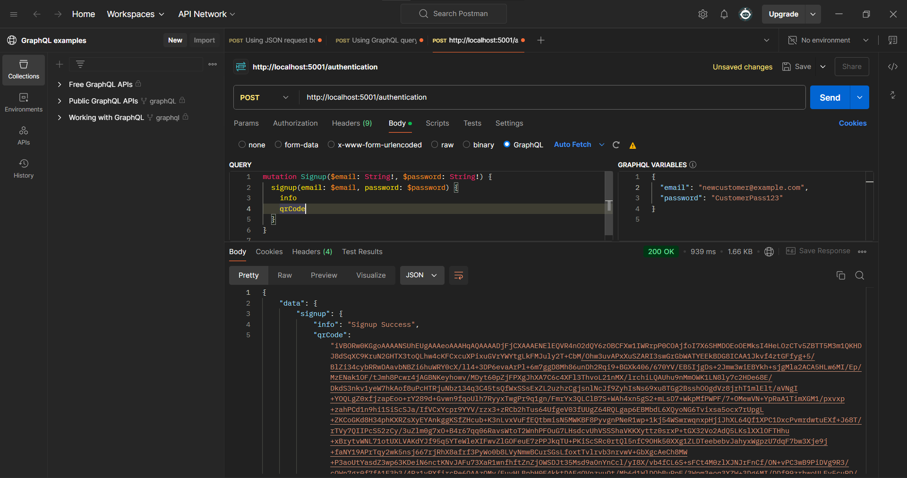
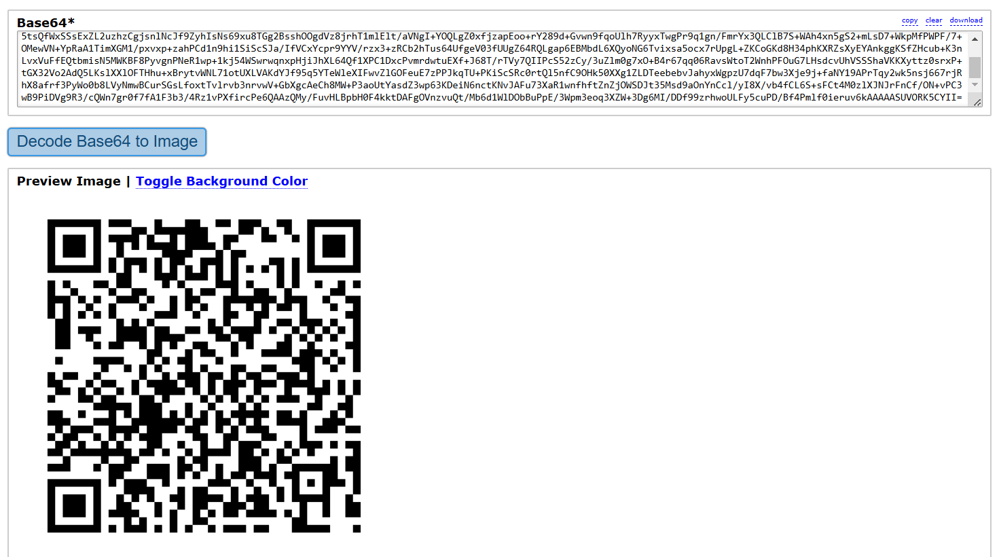
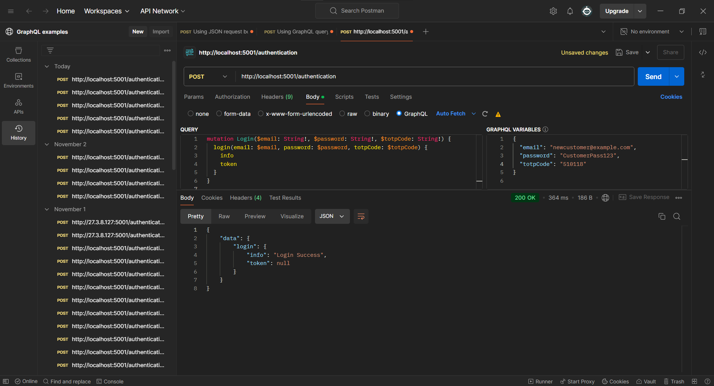

# Authentication API references

```
http://localhost:5001/authentication
```

## 1. Sign Up



```graphQL

mutation Signup($email: String!, $password: String!) {
  signup(email: $email, password: $password) {
    info
    qrCode
  }
}

{
  "email": "newcustomer@example.com",
  "password": "CustomerPass123"
}


```
### 1.1 Pre-share key QR



## 2. Sign In



```graphQL

mutation Login($email: String!, $password: String!, $totpCode: String!) {
  login(email: $email, password: $password, totpCode: $totpCode) {
    info
    token
  }
}

{
  "email": "newcustomer@example.com",
  "password": "CustomerPass123",
  "totpCode": "510118"
}


```
