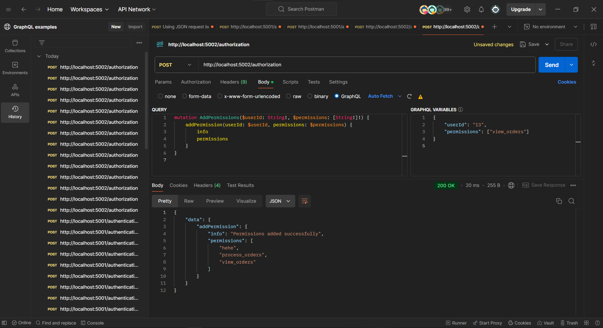
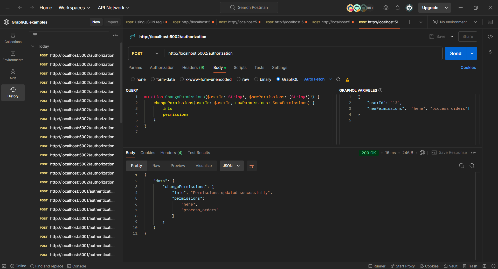
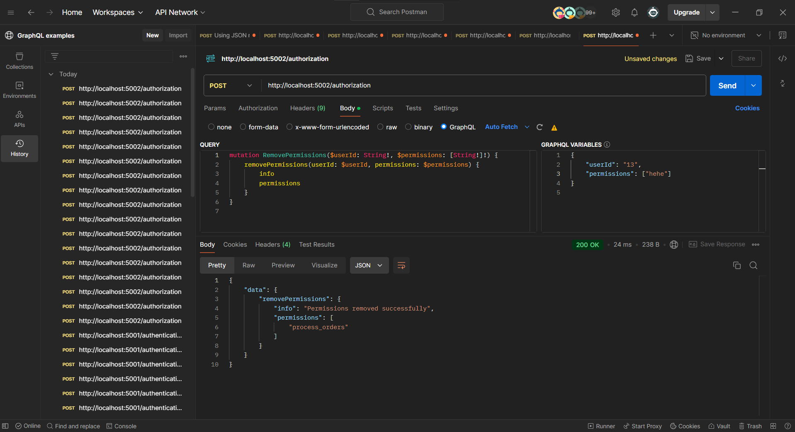

# Authorization API references

```
http://localhost:5002/authorization
```

## 1. Add Permissions



```graphQL

mutation AddPermissions($userId: String!, $permissions: [String!]!) {
    addPermission(userId: $userId, permissions: $permissions) {
        info
        permissions
    }
}

{
    "userId": "13",
    "permissions": ["view_orders"]
}


```

## 2. Change Permissions



```graphQL

mutation ChangePermissions($userId: String!, $newPermissions: [String!]!) {
    changePermissions(userId: $userId, newPermissions: $newPermissions) {
        info
        permissions
    }
}

{
    "userId": "13",
    "newPermissions": ["hehe", "process_orders"]
}


```

## 3. Remove Permissions



```graphQL

mutation RemovePermissions($userId: String!, $permissions: [String!]!) {
    removePermissions(userId: $userId, permissions: $permissions) {
        info
        permissions
    }
}

{
    "userId": "13",
    "permissions": ["hehe"]
}

```
